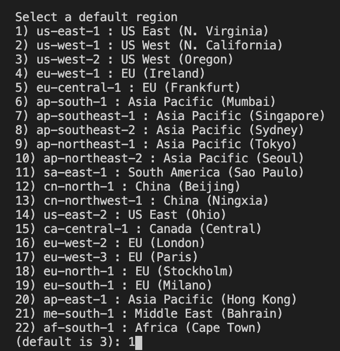

# AWS Beanstalk Demo
Demo project to show how to integrate your applications with AWS Elastic Beanstalk.

It contains two applications to be deployed:
1. [Crew API](https://github.com/robertem/aws-beanstalk-demo/tree/master/crew-api): A basic spring boot application which exposes Rest APIs and will be deployed by AWS Console. 
2. [Digital Banking API](https://github.com/robertem/aws-beanstalk-demo/tree/master/digital-banking-api): A Node-Express server which will be deployed by EB CLI.

## Requirements
To use AWS services you need:

- [AWS Account](https://aws.amazon.com/es/console/) to access services and resources via console and CLI. To access from CLI, it's necessary that you have a user with enough privileges and count with his access-id and secret-key, you can create it following this [link](https://docs.aws.amazon.com/es_es/IAM/latest/UserGuide/id_users_create.html).
- [AWS CLI](https://docs.aws.amazon.com/es_es/cli/latest/userguide/cli-chap-install.html) to execute commands to manage AWS resources from your terminal. This is optional if you want to interact with other AWS resources.
- [EB CLI](https://docs.aws.amazon.com/elasticbeanstalk/latest/dg/eb-cli3-install.html) to execute commands to create, configure and deploy applications in Elastic Beanstalk from your terminal.

To build and run the applications, you can find the requeriments and how to setup in their folders.

## Deploying application by AWS Console

For this method, we are using the application named [crew-api](https://github.com/robertem/aws-beanstalk-demo/tree/master/crew-api).

First of all, you need to generate an artifact of your application which will be deployed in AWS. Follow the steps indicated in its README, this results in an artifact named crew-api.jar located in target directory.

Open your [AWS Console](https://console.aws.amazon.com/) and login with your main account or user whit privileges like admin.

Set your default region where you want to work, your application will be deployed in this region. For this example we are using us-east-1.

Go to Elastic Beanstalk panel, you can find it looking in the service list of home or typing in the search input at the top. Your panel looks like this.

Select Applications option and click on Create Application. It shows your a form where you have to introduce info about your application.

1. Application name: Specify the name of your application. Set 'crew-cli'.
2. Application tags: Define tags for your application in order to be found or related whit other AWS resources, this is optional. Keep in blank for this example.
3. Platform: Specify the platform where your application run. Set Java because or project is a springboot application.
4. Platform branch and version: More specifications for our platform like java version or OS. Keep them in default values.
5. Application code: Select the source code of our application we need to deploy, you can choose an example application given by AWS or upload your own artifact or source code. Choose Upload your code and upload cri-api.jar generated in previous steps.


Let's choose Create to finish the process, probably console shows your the process of deployment, you will be able to see all resources that Elastic Beanstalk is creating for our application. When the process finish, you will see your panel like this.


That's because Beanstalk assumes application will listen on port 5000, but spring boot application listen on port 8080 by default. So in order to fix this discrepancy, we will change the listening port of our application by setting an environment property named SERVER_PORT, whit this property, the application will change its listening port (that's a auto configuration property of spring boot). To do that, select Configuration option in our environment, then edit Software category. Your will see a panel like this.


In the Environment properties section, add SERVER_PORT property and set the value to 5000. Select Apply to finish. Your Environment will try to restart to apply changes. When the process is completed, you will see your panel with Success state.


That's all!, you have your application ready to be used. To test it, use the postman given in the application directory and change host variable whit the URL provided in your environment.


## Deploying application by EB CLI

For this method, we are using the application named [digital-channel-api](https://github.com/robertem/aws-beanstalk-demo/tree/master/digital-banking-api). Please check the requirements specified in its README before going steps below.

To deploy this application, it's just necessary a terminal, but we will use [VSCode](https://code.visualstudio.com/download) to explore and modify files in the project.

First of all, clone the repo and open application folder in VSCode. 

Check the package.json, it defines some scripts that will be used to deploy and run the application in Beanstalk.

- build: Command used to generate and compress the source code that will be uploaded. It generates a artifact.zip in dist folder.
- start: Beanstalk by default execute this command to run the application after being deployed.

Generate artifact by executing `npm run build`. Your dist folder should look like this.


Now, it's time to interact whit EB CLI, open a terminal in VSCode a run the command `eb init`.

1. First, the EB CLI prompts you to select a region. Type the number that corresponds to the region that you want to use, and then press Enter.



2. Next, provide your access-id and secret-key if it's the first time you are using EB CLI or AWS CLI.
3. Type the name of your application (digital-channel-api by default)
4. EB CLI scan your project and suggest you are using NodeJS, confirm this. Otherwise you have to select other platform that matches the language or framework of your project.
5. Choose Yes to assign an SSH key pair. This allows you to connect to your instances.
6. Select an existing key pair or create new one.


Now, your EB CLI project is configured and ready to use. A config.yml was generated in elasticbeanstalk folder. Open it in the editor.

We need to specify to Beanstalk where is the source code we want to deploy, in our case is dist/artifact.zip, if you don't, EB CLI deploy project folder by default. Add the following lines and save the changes.

```yaml
deploy:
  artifact: dist/artifact.zip
```


It's time to create your first environment where infrastructure will be provisioned, run the command `eb create` in the terminal.

1. Type the environment name (digital-banking-api-dev).
2. Type the DNS NAME prefix (digital-banking-api-dev), it will be part of the URL provided by Beanstalk.
3. Choose the load balancer type to route traffic to our instances, for this kind of project like APIs, Application is the option.
4. Disable Spot Fleet requests for the environment.


EB CLI will start to provide the environment with all infrastructure and resources needed. You can see in the terminal the step by step. 

That's all, when the process is finished, you will see in your AWS console a new application and its environment like the first demo. To test it, use the postman given in the application directory and change host variable whit the URL provided in your environment. 


If you want to deploy an update of your project, just run `eb deploy`.

For more information about eb commands, check this [link](https://docs.aws.amazon.com/elasticbeanstalk/latest/dg/eb3-cmd-commands.html).
